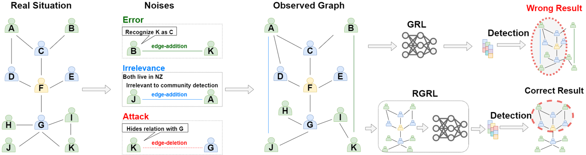
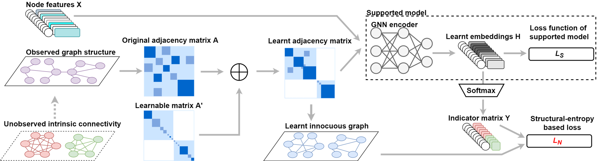

# USER: Unsupervised Structural Entropy-based Robust Graph Neural Network (AAAI-2023)

Yifei Wang, Yupan Wang, Zeyu Zhang, Song Yang, Kaiqi Zhao, Jiamou Liu*

The University of Auckland, Auckland, New Zealand

{wany107, ywan980, zzha669, syan382}@aucklanduni.ac.nz, {kaiqi.zhao, jiamou.liu}@auckland.ac.nz
<!--#### -->

## Introduction
Unsupervised/self-supervised graph neural networks (GNN) are vulnerable to inherent randomness in the input graph data which greatly affects the performance of the model in downstream tasks. 



In this paper, we alleviate the interference of graph randomness and learn appropriate representations of nodes without label information. To this end, we propose USER, an unsupervised robust version of graph neural networks that is based on structural entropy. We analyze the property of intrinsic connectivity and define intrinsic connectivity graph. We also identify the rank of the adjacency matrix as a crucial factor in revealing a graph that provides the same embeddings as the intrinsic connectivity graph. We then introduce structural entropy in the objective function to capture such a graph. 
Extensive experiments conducted on clustering and link prediction tasks under random-noises and meta-attack over three datasets show USER outperforms benchmarks and is robust to heavier randomness.



## Datasets

* [Cora](https://github.com/kimiyoung/planetoid/tree/master/data)

* [Citeseer](https://github.com/kimiyoung/planetoid/tree/master/data)

* [Wiki](https://github.com/kimiyoung/planetoid/tree/master/data)

## Requirements

* python == 3.7
* pytorch ==1.8
* networkx == 2.5
* deeprobust == 0.2.4
* torch-geometric == 2.0.1


## Command and configurations

### Node clustering
#### Generate random noises
```shell
python random_attack.py  
```
#### Generate meta-attack result
```shell
python meta_attack.py  
```
#### USER for node clustering
```shell
python attack_main.py
```

### Link prediction
#### Generate random noises
```shell
python lp_random_attack.py  
```

#### USER for link prediction
```shell
python lp_attack_main.py
```